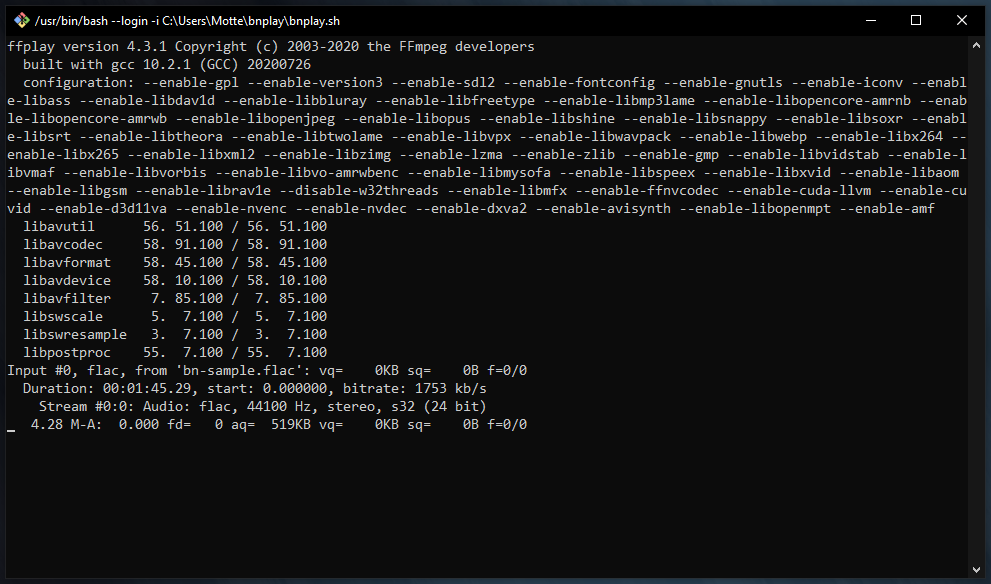
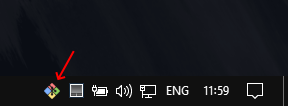

# bnplay


**B**rown **N**oise **play**er.

## Web version

Follow one of these links to play brown noise within your web browser. If one doesn't work, try the other.

- :speaker: [**Audio tag version**](https://dmotte.github.io/bnplay/bnplay-audio-tag.html): this uses the [HTML `<audio>` tag](https://www.w3schools.com/tags/tag_audio.asp)
- :speaker: [**Audio API version**](https://dmotte.github.io/bnplay/bnplay-audio-api.html): this uses the [Web Audio API](https://developer.mozilla.org/en-US/docs/Web/API/Web_Audio_API)

## Desktop version

If you prefer to listen to brown noise locally, I made two **shell scripts**. They have both been tested with _Git Bash_ on _Windows 10_, but should work on other systems too.

1. **Clone** the repository on your computer
2. Install **ffmpeg** if you do not have it installed. I suggest installing it via the [_Chocolatey_ package manager](https://chocolatey.org/install):
   ```cmd
   choco install -y ffmpeg
   ```
3. If you would like to use _Git Bash_ &rarr; execute the [`bnplay.sh`](bnplay.sh) script. If you would like to use _cmd.exe_ &rarr; execute the [`bnplay.cmd`](bnplay.cmd) script
4. If you want to minimize the application in the **Windows tray bar** while it is running, you can do it by installing **RBTray**:
   ```cmd
   choco install -y rbtray
   ```

## Screenshots

BNPlay running in **Git Bash**:



BNPlay running in _Git Bash_, minimized in the Windows tray bar with the help of **RBTray**:


